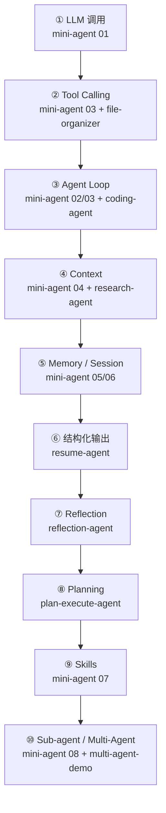

# COURSE_MAP ·《智能体应用与开发》实践课程地图

> 配套源码阅读指南：[case-study/guide/](case-study/guide/)
> 配套从零实现教程：[mini-agent/](mini-agent/)
> 所有 Demo 均可无 API Key 运行（内置 Mock LLM）；配置 `MINI_AGENT_API_KEY`（或 `OPENAI_API_KEY`，可用 `MINI_AGENT_BASE_URL`/`MINI_AGENT_MODEL` 指向任意 OpenAI 兼容服务）即切换真实模型。

## 学习路线总览

## 一、简单（第 1~4 周，每 Demo 一个概念）

| 顺序 | Demo / 教程 | 核心知识点 | 课堂要点 |
|---|---|---|---|
| 1 | [mini-agent 01-basic-chat](mini-agent/01-basic-chat/) | LLM 调用、messages 数组 | 一切的地基；mock 与真实模型的接口一致性 |
| 2 | [campus-assistant-agent](patterns/campus-assistant-agent/) | 工具选择（意图路由） | description 是写给模型的索引；事实类问题必须查工具 |
| 3 | [resume-agent](patterns/resume-agent/) | 结构化输出 + 校验重试 | 不信任模型输出；「格式对≠内容对」 |
| 4 | [file-organizer-agent](patterns/file-organizer-agent/) | Tool Calling 闭环 + 路径安全 | 观察结果回填；workingDir 边界；一次多个工具调用 |
| 5 | [content-creator-agent](patterns/content-creator-agent/) | Prompt Chaining 流水线 | 与 Loop 对照：流程写死 vs 模型自主 |

## 二、中等（第 5~9 周，概念组合）

| 顺序 | Demo / 教程 | 核心知识点 | 课堂要点 |
|---|---|---|---|
| 6 | [mini-agent 02/03](mini-agent/02-agent-loop/) | Agent Loop、停止条件 | 三个停止条件；工具错误=观察结果 |
| 7 | [coding-agent](patterns/coding-agent/) | 测试驱动修复循环 + 命令白名单 | Agent 与脚本的分水岭；白名单优先于提示词 |
| 8 | [research-agent](patterns/research-agent/) | 多步检索 + 引用约束 | search→read→synthesize；防幻觉的 system 约束 |
| 9 | [mini-agent 04-context](mini-agent/04-context/) | Context 裁剪、token 估算 | transcript≠context；截断保留头尾 |
| 10 | [mini-agent 05/06](mini-agent/05-session/) | Session 持久化、Memory 注入 | 「读隐式、写显式」的记忆分工 |
| 11 | [data-analysis-agent](patterns/data-analysis-agent/) | 代码即工具 + 沙箱意识 | 模型出思路、runtime 出数字；执行模型代码必须隔离 |
| 12 | [reflection-agent](patterns/reflection-agent/) | Reflection 反思循环 | 结构化批评；有界重试（及格线+轮数上限） |

## 三、综合（第 10~14 周，架构级组合）

| 顺序 | Demo / 教程 | 核心知识点 | 课堂要点 |
|---|---|---|---|
| 13 | [plan-execute-agent](patterns/plan-execute-agent/) | Planner/Executor + 失败重规划 | 计划是显式状态；验证步骤暴露缺口 |
| 14 | [mini-agent 07-skills](mini-agent/07-skills/) | Skill 渐进式披露 | 两级加载解决「知识撑爆 system」 |
| 15 | [mini-agent 08-subagent](mini-agent/08-subagent/) | Sub-agent | 子过程被压缩成一条观察结果 |
| 16 | [multi-agent-demo](patterns/multi-agent-demo/) | 协调者-Workers 模式 | 角色=prompt；worker 之间不直接对话 |
| 17 | [mini-agent 09-compaction](mini-agent/09-compaction/) | Context Compaction | 摘要为什么放 system；与裁剪的分工 |
| 18 | [mini-agent 10-complete-agent](mini-agent/10-complete-agent/) | 总装 + 学生扩展作业 | 期末项目起点 |

## 每阶段的标准课堂流程（90 分钟）

1. **10 min** 跑 Demo（mock 模式，全班看到相同输出）
2. **15 min** 对照 README 的「架构图」讲 1~2 个知识点
3. **20 min** 打开对应源码文件，找到 README「对应知识点」表里列的函数/行号
4. **30 min** 上机：完成 README 的扩展作业之一（从易到难可选）
5. **15 min** 有 API Key 的同学切真实模型重跑，对比 mock 与真实行为差异

## 知识点 × 素材矩阵（备课速查）

| 知识点 | 源码章节 | mini-agent | 课程 Demo |
|---|---|---|---|
| LLM 调用/模型切换 | [04-llm](case-study/guide/04-llm.md) | 01 | — |
| Tool Calling | [05-tools](case-study/guide/05-tools.md) | 03 | file-organizer, campus-assistant |
| Agent Loop | [02-agent-loop](case-study/guide/02-agent-loop.md) | 02, 03 | coding-agent |
| Context 管理 | [03-context](case-study/guide/03-context.md) | 04, 09 | research-agent（引用约束） |
| Session / Memory | [06-session-memory](case-study/guide/06-session-memory.md) | 05, 06 | — |
| 结构化输出 / 校验重试 | [05-tools](case-study/guide/05-tools.md)（zod 校验入参）+ [10-error-recovery](case-study/guide/10-error-recovery.md)（失败当观察结果） | — | resume-agent |
| Reflection | — | — | reflection-agent |
| Planning | [08-subagent](case-study/guide/08-subagent.md)（状态机部分） | — | plan-execute-agent |
| Skills / 扩展 | [07-skills-extensions](case-study/guide/07-skills-extensions.md) | 07 | — |
| Sub-agent / 多 Agent | [08-subagent](case-study/guide/08-subagent.md) | 08 | multi-agent-demo |
| 错误恢复 / 安全 | [10-error-recovery](case-study/guide/10-error-recovery.md) | 10（作业） | coding-agent（白名单）, data-analysis（沙箱） |

## 期末项目建议

以 [mini-agent 10-complete-agent](mini-agent/10-complete-agent/) 为骨架，任选一个方向深化：

1. **垂直场景 Agent**：结合某个 patterns 的领域（校园/简历/数据分析），补全工具与安全策略
2. **可靠性方向**：实现审批流（require_approval）+ 事件 JSONL + 断点恢复
3. **多 Agent 方向**：协调者 + 2 个带受限工具的 worker，产出可验证的成果物

评分建议：可运行（30%）· 概念正确（30%）· 安全边界意识（20%）· 文档与实验记录（20%）。
