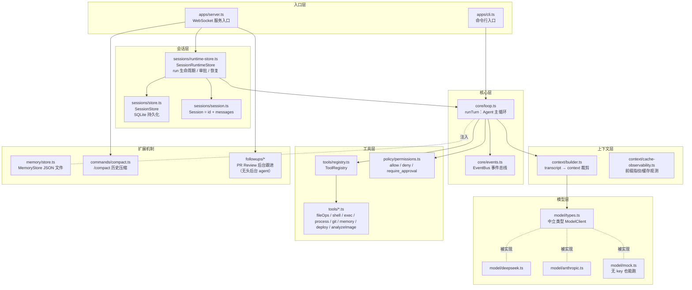
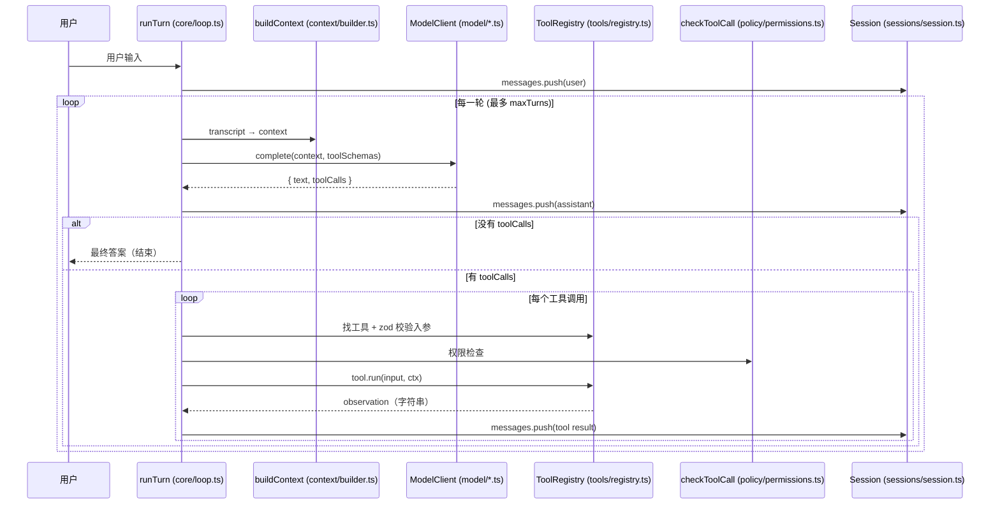

# 00 · 总览：这个项目到底做了一个什么东西

> 阅读对象：第一次接触 Agent 内部实现的同学。
> 阅读方法：每篇文档都会给出 **真实源码路径 + 核心函数 + 行号**。请边读边打开对应源码对照。

## 一句话概括

`my-agent-runtime` 是一个**个人自用的 Coding Agent 运行时**：

- 一个**循环（loop）**：把用户任务发给大模型 → 模型要么给最终答案、要么要求调工具 → 工具结果塞回历史 → 再问模型……直到任务完成或到达轮数上限。
- 一套**中立模型适配层**：loop 不关心背后是 DeepSeek / Anthropic / Mock，只认统一接口。
- 一组**工具（手）**：读写文件、跑 shell、管进程、看 git、记笔记……
- 三层**状态**：Session（transcript 历史）、Memory（跨会话事实）、事件流（可回放日志）。
- 一层**安全**：路径锁在 workingDir、危险命令正则拦截、需要人批准的审批通道。

## 分层架构图



## 一个 run 的完整流程（先记住这张图）



## 三层时间结构：Session > Run > Turn

这是全文最重要的概念区分（见 `runtime/sessions/session.ts:7-9` 的注释）：

| 层 | 是什么 | 代码位置 | 生命周期 |
|---|---|---|---|
| **Session** | 一条持续的对话线，持有 transcript（全部历史） | `sessions/session.ts:11-14` | 跨多次 run 累积，SQLite 持久化 |
| **Run** | 用户发一句话 → loop 跑到给出最终答案 | `core/loop.ts` 的 `runTurn()` | 一次函数调用 |
| **Turn** | 一次「调模型 + 可能调工具」 | `core/loop.ts:169` 的 for 循环体 | run 内的一圈 |

## 目录速查

```
runtime/
├── apps/            入口：cli.ts（命令行）、server.ts（WebSocket 服务）
├── core/            loop.ts（主循环）、events.ts（事件总线）、serial-queue.ts
├── context/         builder.ts（上下文裁剪）、cache-observability.ts、debugger.ts
├── model/           types.ts（中立类型）、deepseek.ts、anthropic.ts、mock.ts
├── tools/           registry.ts + 各工具实现 + exec.ts + sandbox.ts
├── policy/          permissions.ts（安全策略）
├── sessions/        session.ts、store.ts（SQLite）、runtime-store.ts（run 生命周期）
├── memory/          store.ts（跨会话持久记忆）
├── commands/        compact.ts（历史压缩）、registry.ts（/命令解析）
├── followups/       PR Review 后台自动跟进（无头后台 agent + 状态机 + 调度器）
├── evals/           replay.ts（事件回放）、deepseek-cache-ab.ts
└── config.ts        环境变量 → appConfig
web/                 浏览器前端（连接 server.ts 的 WebSocket）
```

## 本指南目录

| 篇 | 主题 | 对应源码 |
|---|---|---|
| [01](01-project-structure.md) | 项目结构 | 全仓库 |
| [02](02-agent-loop.md) | Agent Loop | core/loop.ts |
| [03](03-context.md) | Context 维护 | context/builder.ts |
| [04](04-llm.md) | LLM 调用与模型切换 | model/*.ts |
| [05](05-tools.md) | 工具系统 | tools/*.ts |
| [06](06-session-memory.md) | Session 与 Memory | sessions/、memory/ |
| [07](07-skills-extensions.md) | 扩展机制 | events.ts、registry.ts |
| [08](08-subagent.md) | Sub-agent / 后台 Agent | followups/ |
| [09](09-context-compaction.md) | Compaction | commands/compact.ts |
| [10](10-error-recovery.md) | 错误恢复与中断 | loop.ts、exec.ts、runtime-store.ts |
| [11](11-complete-call-chain.md) | 完整调用链 | 入口 → 最终答案 |
| [12](12-reading-roadmap.md) | 阅读路线图 | — |
