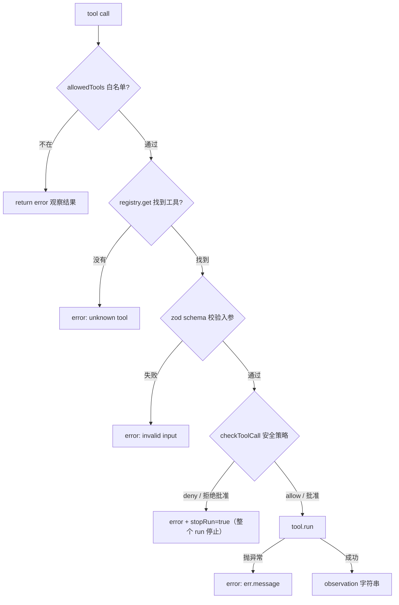
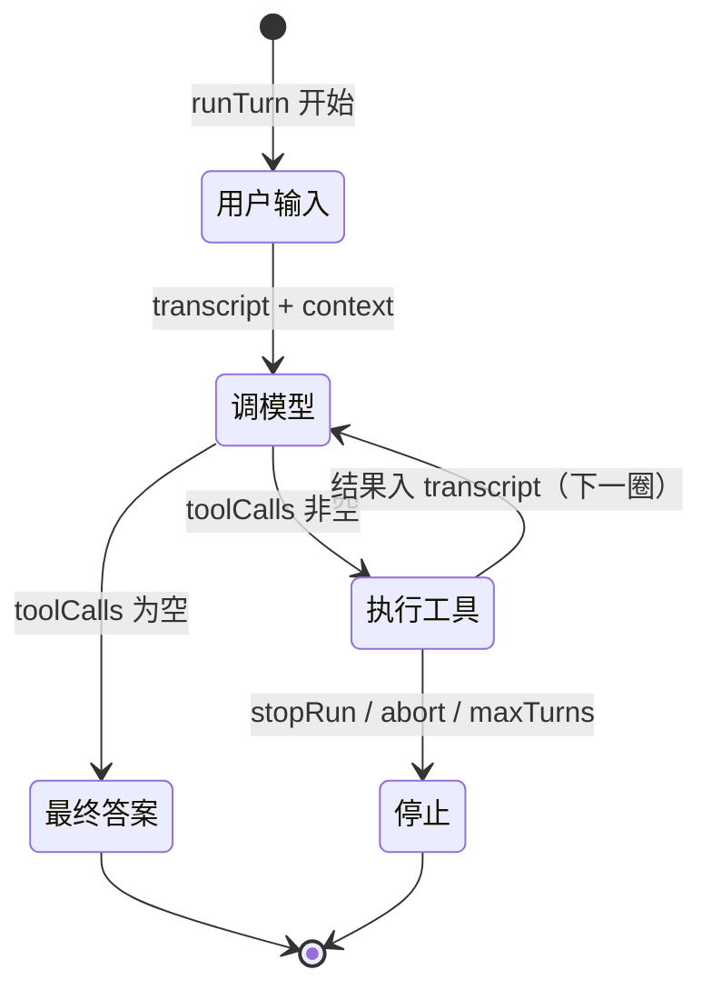

# 02 · Agent Loop：整个项目的心脏

> 主角文件：`runtime/core/loop.ts`（约 400 行）。读懂它 = 读懂这个项目的一半。

## Loop 是什么

Agent Loop 解决一个问题：**模型一次回复解决不了任务时，怎么让它持续干活？**

答案是一个循环：

```
问模型 → 模型说"我要调工具" → 执行工具 → 结果塞回历史 → 再问模型 → …
                                    └→ 模型说"完成了"（不再调工具）→ 结束
```

## 核心函数 runTurn

位置：`core/loop.ts:147`，签名：

```ts
export async function runTurn(session: Session, userInput: string, deps: RunDeps): Promise<string>
```

- `session`：持有完整历史 `messages`（跨 run 累积，见 [06-session-memory](06-session-memory.md)）
- `deps: RunDeps`（`core/loop.ts:36-43`）：model、registry、events、config、approve（审批回调）、checkpoint（持久化回调）

### 逐步拆解 runTurn（对应源码行号）

**第 0 步：修复上次中断留下的残局**（`core/loop.ts:153-161`）
调用 `repairInterruptedToolCalls()`（`:312`）扫描 transcript：如果某个 assistant 消息声明了 toolCalls 但没有对应 tool result（上次进程崩了），就补一条 error 观察结果。这保证发给模型的历史永远是合法的「调用-结果」配对。

**第 1 步：用户输入进 transcript**（`core/loop.ts:163-166`）

```ts
session.messages.push({ role: "user", content: userInput });
deps.checkpoint?.(session);          // 立刻持久化到 SQLite
events.log({ type: "user_message", content: userInput });
```

注意：loop 自己不持有历史，读写的都是 `session.messages`。**多轮对话的本质就是第二次 runTurn 时历史还在。**

**第 2 步：主循环**（`core/loop.ts:169`）

```ts
for (let turn = 1; turn <= config.maxTurns; turn++) {
```

`maxTurns`（默认 32，`config.defaults.ts:14`）是防死循环的安全阀。每圈开始先检查中止信号 `signal?.aborted`（`:171-173`）。

**2a. 构建本轮 context**（`core/loop.ts:177-201`）
- `config.memoryContext?.()` 每圈**重新读取**最新记忆（所以工具刚写的记忆下一圈就生效）
- `withMemoryContext()`（`:346-355`）把记忆作为一条 system 消息插到所有 system 消息之后
- `buildContext()` 把（可能很长的）transcript 裁剪成本轮要发的 messages → 详见 [03-context](03-context.md)
- emit `context_built` 事件，带上 token 估算和裁剪决策

**2b. 调模型**（`core/loop.ts:204-218`）

```ts
res = await signalRace(model.complete(built.messages, toolSchemas, signal), signal);
```

- `signalRace`（`:51-73`）：让 await 在外部中止信号触发时立即 reject
- 模型回复记进 transcript：`session.messages.push({ role: "assistant", content: res.text, toolCalls: res.toolCalls })`（`:224-230`）

**2c. 分岔口：没有 toolCalls = 任务完成**（`core/loop.ts:234-237`）

```ts
if (res.toolCalls.length === 0) {
  events.log({ type: "final_answer", content: res.text });
  return res.text;
}
```

**这就是 loop 的停止条件：模型不再要求调工具。** 另一停止条件是打满 maxTurns（`:303-304`，返回 `"(stopped: reached maxTurns)"`）。

**2d. 执行每个工具调用**（`core/loop.ts:241-300`）

对 `res.toolCalls` 逐个执行，每次都：emit `tool_call` → `executeTool()` → emit `tool_result` → **结果 push 进 transcript** → `checkpoint`。

关键点：**工具结果以 `role: "tool"` 消息进入 transcript，下一轮 buildContext 时自然出现在发给模型的历史里**——这就是「工具结果重新加入上下文」的机制，没有任何特殊通道。

### executeTool：单次工具执行的完整管线

位置：`core/loop.ts:365-397`。五个关卡，任何一关失败都返回 `error: ...` 字符串而不是抛异常：



**最重要的设计**（`core/loop.ts:357-359` 的注释）：工具出错**不抛异常中断 loop**，而是把错误当作「观察结果」还给模型，让模型自己看到错误、自己决定重试还是换路——这正是 agent 比死板脚本强的地方。

唯一的例外是 `stopRun: true`：安全策略拒绝时 loop 会停止整个 run，并把同轮剩余的 tool calls 补成 cancelled 结果（`:283-299`），保持 transcript 配对完整。

## 中断处理：三种场景全配对

用户中途点「停止」时，已经发出但没结果的工具调用必须补上结果，否则下次发给模型的历史不合法。`abortToolLoop()`（`core/loop.ts:95-139`）处理三种场景：

| 场景 | 时机 | 处理 |
|---|---|---|
| A | 循环开头发现 aborted，当前 call 还没 emit | 为当前和剩余所有 call 补 cancelled 结果 |
| B | `executeTool` 被 signalRace reject | 补 cancelled result（工具可能实际执行了） |
| C | executeTool 返回后才发现 aborted | 用真实 observation，只补剩余 call |

场景 B 还有 5 秒宽限期（`core/loop.ts:262-270`）：等工具真实结果；等不到才写 cancelled。细节见 [10-error-recovery](10-error-recovery.md)。

## Loop 状态流转图



## 动手验证

```bash
cd runtime && npm run agent -- --mock "建一个 hello.js 并运行它"
```

对照输出里的 `⟳ model` / `🔧 call` / `📥 result` / `✅ final`，它们就是 `core/events.ts:90` 的 `printEvent` 在打印 loop 每一步 emit 的事件。

## 下一章

loop 每圈都调 `buildContext` 裁剪历史 → 看 [03-context.md](03-context.md)。
