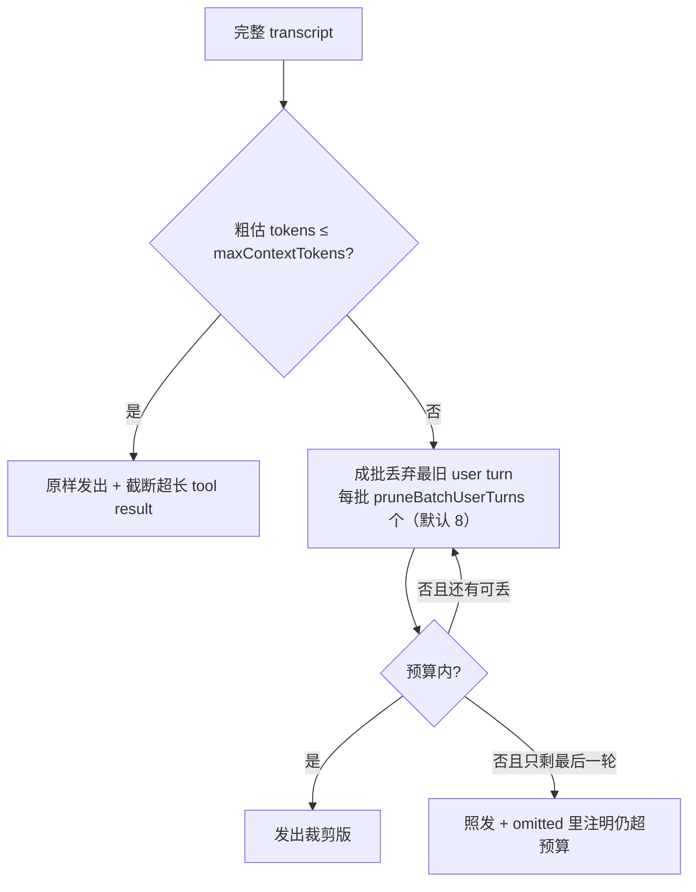

# 03 · Context：transcript 和发给模型的内容是两回事

> 主角文件：`runtime/context/builder.ts`（约 240 行）。
> 核心公式：**transcript（全量历史，普通 run 中只追加；唯一显式重写是 /compact，见 [09](09-context-compaction.md)）→ buildContext（按规则裁剪）→ 本轮真正发出的 messages**。

## 为什么需要单独一层

- transcript 必须完整持久化（回溯、审计、恢复现场都要它）
- 但模型上下文窗口有限、token 有成本，超长工具结果还会稀释注意力
- 所以「存什么」和「发什么」必须解耦：**session 存全量，builder 决定发什么**

## 入口函数 buildContext

位置：`context/builder.ts:30-36`。按 `config.strategy` 分两条路：

```ts
export function buildContext(transcript: Message[], config: ContextConfig): BuiltContext {
  if ((config.strategy ?? "cache-first") === "cache-first") {
    return buildCacheFirstContext(transcript, config);
  }
  return buildLegacyWindowContext(transcript, config);
}
```

返回值 `BuiltContext`（`builder.ts:18-23`）：

| 字段 | 含义 |
|---|---|
| `messages` | 这轮真正发给模型的内容 |
| `included` / `omitted` | 放了什么 / 省了什么+原因（给 debugger 和 web 面板看） |
| `tokenEstimate` | 粗估 token（`estimateTokens` `builder.ts:219`：chars/4） |

## 策略一：cache-first（默认）

位置：`buildCacheFirstContext` `builder.ts:38-65`。

设计思想（`builder.ts:3-5` 注释）：**预算内保留完整 transcript，让 prompt 前缀尽量不变，好命中厂商的 prompt cache；只在越过预算时成批移除最旧的完整 user turn。**

流程：



关键细节：
- 裁剪单位是「**完整 user turn**」（一个 user 消息 + 它引发的全部 assistant/tool 消息），绝不在 turn 中间拆——`findUserTurnStarts` `builder.ts:157-163` 找 user 消息位置，`buildCacheFirstCandidate` `builder.ts:67-101` 从第 N 个 user turn 开始保留。
- 至少保留最后一轮：`maxDroppable = userTurns - 1`（`builder.ts:44`）。

## 策略二：legacy-window（旧行为，可 A/B 和回退）

位置：`buildLegacyWindowContext` `builder.ts:103-122`。

- 保留「最近 N 轮」（`recentTurns`，默认 32）；一轮 = 一条 assistant 消息 + 它后面的 tool 消息
- `tagTurns`（`builder.ts:177-183`）：每遇到 assistant 轮号 +1；**system 和 user 是锚点，轮号 -1，永远保留**（任务目标不能被裁掉）
- 超预算时逐级减少 N 重试（`builder.ts:108-114`）

## 两个策略通用的动作：截断超长工具结果

`compactToolResult` `builder.ts:197-208`：单条 tool result 超过 `maxToolResultChars`（默认 12000，`config.defaults.ts:20`）就**截断而不是丢弃**，且用 `truncateMiddle`（`builder.ts:232-236`）保留头尾、中间标注省了多少——关键信息常在两端（命令输出开头、报错堆栈结尾）。

## 缓存观测：为什么默认策略叫 cache-first

`context/cache-observability.ts`：

- `fingerprintPrompt`（`:16-29`）给 prompt 算 SHA-256 指纹（promptHash / prefixHash / toolsHash / memoryHash）
- loop 里（`core/loop.ts:181-188`）把上一轮的指纹存进 `previousPromptBySession`（WeakMap，`core/loop.ts:45-48`），下一轮对比 `toolsHash` 没变时数「两次请求共享多少条前缀消息」`countSharedPrefixMessages`（`:31-36`）
- 这些数字随 `context_built` / `model_usage` 事件发出，用于验证裁剪策略真的保住了缓存前缀

## 可视化调试

- `context/debugger.ts` 的 `formatContextDebug`：CLI 加 `--debug-context` 打印每轮「放了什么/省了什么/token 多少」
- web 面板消费 `context_built` 事件展示同样信息

## 注入点回顾：memory 和 summary 怎么进来

- **Memory**：`withMemoryContext`（`core/loop.ts:346-355`）在 buildContext **之前**把记忆文本插成一条 system 消息——所以它也参与裁剪和 token 估算
- **Compact 摘要**：`/compact`（[09](09-context-compaction.md)）把旧历史替换成一条「摘要 system 消息」，直接写回 transcript，之后每轮 buildContext 自然携带它

## 一张图总结

```mermaid
flowchart LR
    subgraph 持久层（追加为主，/compact 显式重写是唯一例外）
        T[(session.messages<br/>transcript)]
    end
    subgraph 每轮构建
        M[memoryContext 最新记忆] --> I[withMemoryContext<br/>插 system 消息]
        T --> I
        I --> B[buildContext<br/>cache-first / legacy-window]
        B --> C[截断超长 tool result]
    end
    C --> O[发出 messages<br/>+ token 估算 + 决策审计]
```

## 动手验证

```bash
cd runtime && npm run agent -- --mock --debug-context --max-context-tokens 300 "建一个 hello.js 并运行它"
```

把预算压到 300 tokens，观察 `context debug` 框里的 omitted 决策。
