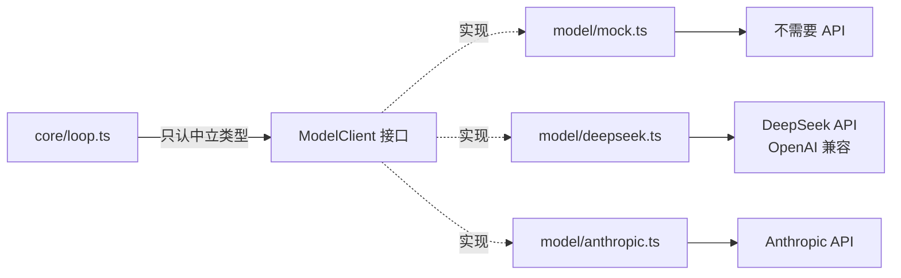

# 04 · LLM 调用：中立类型 + Provider 翻译器

> 主角文件：`runtime/model/types.ts`（55 行，先读它）。
> 核心思想：**loop 只认一套与厂商无关的类型；每个 provider 负责把它翻译成各家 API 格式。**

## 第 1 步：读懂中立类型 model/types.ts

| 类型 | 位置 | 作用 |
|---|---|---|
| `Message` | `model/types.ts:15-19` | 四种角色：system / user / assistant（可带 `reasoningContent`、`toolCalls`）/ tool（带 `toolCallId`） |
| `ToolCall` | `model/types.ts:8-12` | `{ id, name, input }`——id 用来把结果对回去 |
| `ToolSchema` | `model/types.ts:22-26` | 给模型看的「工具说明书」：name + description + JSON Schema |
| `ModelResponse` | `model/types.ts:43-48` | provider 统一返回形状：`{ text, reasoningContent?, toolCalls, usage? }` |
| `ModelClient` | `model/types.ts:51-54` | **所有 provider 实现的唯一接口**：`complete(messages, tools, signal?)` |



换模型 = 换一个 `ModelClient` 实现，loop / tools 一行不改（`cli.ts:47-51` 的选择逻辑就是证据）。

## 第 2 步：三个 provider 怎么实现同一个接口

### mock：按剧本演（model/mock.ts:8-43）

不调任何 API，按 `this.turn++` 返回预编排的三轮剧本：写文件 → 运行 → 收尾。存在价值（`mock.ts:4-7` 注释）：
1. 没有 API key 也能把 loop 跑起来、看清机制
2. replay / 测试必须用确定可重复的假模型，否则没法回归

### deepseek：OpenAI 兼容 + 思考模式（model/deepseek.ts）

`complete()`（`deepseek.ts:27-109`）的翻译工作：

**请求方向**：`toDeepseekMessages`（`deepseek.ts:204-237`）把中立 Message[] 翻成 OpenAI 格式。三个协议细节值得学：
- assistant 的 `toolCalls` 翻成 `tool_calls: [{id, type:"function", function:{name, arguments: JSON.stringify(input)}}]`
- **空数组不序列化**：OpenAI 规范要求 tool_calls 出现即非空（`deepseek.ts:217-218` 注释）
- `reasoningContent` 回传成 DeepSeek 扩展字段 `reasoning_content`（思考链要原样传回，否则下一轮报错）

**响应方向**（`deepseek.ts:78-108`）：
- `tool_calls[].function.arguments` 是 **JSON 字符串**，要 try/catch 解析回对象；解析失败给 `{}`（模型给错参数不能崩）
- `reasoning_content` 从 SDK 类型之外的字段里捞（`(msg as unknown as {reasoning_content?})`）
- 兜底：`text` 为空且有思考内容时用思考内容当回复（`deepseek.ts:97-101`）
- usage 映射 `toDeepseekModelUsage`（`deepseek.ts:164-187`）：DeepSeek 特有的 `prompt_cache_hit_tokens` 归到 `cachedInputTokens`

**取消**：`{ signal }` 作为 SDK 第二参数传入，abort 时底层 fetch 直接取消（`deepseek.ts:56`）。

### anthropic：内容块拼装（model/anthropic.ts）

`toAnthropic`（`anthropic.ts:61-85`）展示 Anthropic 的 tool-calling 协议（与 OpenAI 格式对比着学）：

| 差异点 | OpenAI / DeepSeek | Anthropic |
|---|---|---|
| system | messages 里的 system 角色 | **顶层 `system` 参数**（`anthropic.ts:15,20`） |
| 工具声明 | `tools[].function.parameters` | `tools[].input_schema`（`anthropic.ts:22-26`） |
| 工具调用 | assistant.tool_calls | assistant 消息里的 `tool_use` **内容块** |
| 工具结果 | `role:"tool"` 消息 | **user 角色**里的 `tool_result` 块，按 `tool_use_id` 对应（`anthropic.ts:74-82`） |
| 连续结果 | 各自一条 | **合并进同一条 user 消息**（`anthropic.ts:77-79`） |

这些差异全部被 provider 消化，loop 完全无感——这就是适配层的价值。

## 第 3 步：模型如何被选择与切换

| 场景 | 代码 | 切换方式 |
|---|---|---|
| CLI | `apps/cli.ts:47-51` | `--mock` 或没有 `DEEPSEEK_API_KEY` → mock；否则 DeepSeek |
| Web server | `apps/server.ts:122-124` + `modelFor()` `:173-176` | 每个连接认证时定 mode（mock/deepseek），`modelFor(ctx)` 按连接取模型 |
| 环境变量 | `config.ts:68-72` | `DEEPSEEK_API_KEY` / `DEEPSEEK_MODEL`（默认 `deepseek-v4-flash`） |
| 新增 provider | 实现 `ModelClient` 接口 + 注册进入口的 if/else | 不动 loop |

## 调用点的位置（上下游）

```
core/loop.ts:206   res = await signalRace(model.complete(built.messages, toolSchemas, signal), signal)
commands/compact.ts:54  summarize() 也直接用 model.complete 压缩历史（不传工具）
```

usage 事件：`core/loop.ts:219-221` emit `model_usage`，`core/events.ts:126-140` 的 `formatUsage` 打印「估算 vs 实际 token + cache 命中率」。

## 动手验证

```bash
# 无 key 跑 mock（对照 mock.ts 剧本看输出）
cd runtime && npm run agent -- --mock "任何任务"

# 有 key 切真模型（不改一行代码）
DEEPSEEK_API_KEY=sk-xxx npm run agent -- "建一个 hello.js 并运行它"
```
