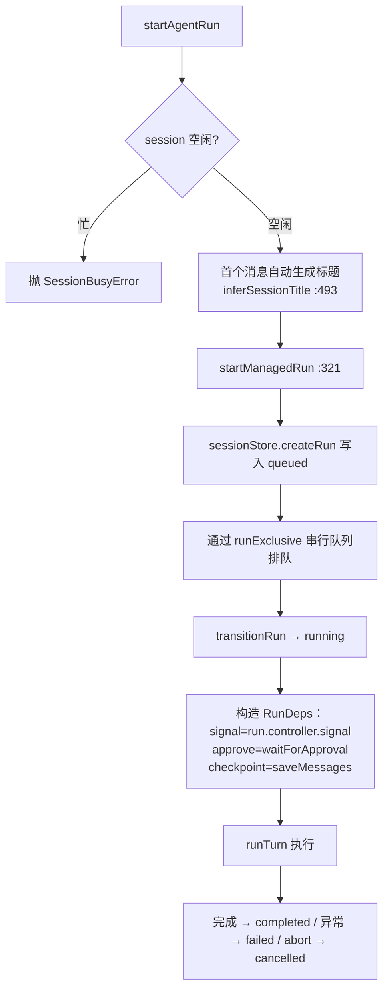

# 06 · Session 与 Memory：两种状态，两种生命周期

> 主角文件：`runtime/sessions/session.ts`（22 行）、`runtime/sessions/store.ts`、`runtime/sessions/runtime-store.ts`、`runtime/memory/store.ts`。
> 一句话区分：**Session = 这条对话的历史（context 的原料）；Memory = 跨对话的事实（进 system 的知识）**。

## Session：三层时间结构的最外层

`sessions/session.ts:11-21`：

```ts
export interface Session {
  id: string;
  messages: Message[]; // 持久 transcript，跨 run 累积
}
export function createSession(id: string, systemPrompt?: string): Session {
  const messages: Message[] = [];
  if (systemPrompt) messages.push({ role: "system", content: systemPrompt });
  return { id, messages };
}
```

两个要点：
1. **system prompt 只在建会话时放一次**（`session.ts:18-19`），不属于单次 run——`core/loop.ts:24` 注释专门强调了这一点
2. Session 本身只是内存对象；持久化由外面注入的 `checkpoint` 回调完成（`core/loop.ts:42`），CLI 不提供（不落盘），server 提供（每步落 SQLite）

## 持久化：SessionStore（SQLite）

`sessions/store.ts:81`，三张表（`store.ts:88-122`）：

| 表 | 存什么 | 给谁用 |
|---|---|---|
| `sessions` | meta + `messages_json`（完整 transcript） | 恢复对话现场 → `saveMessages` `store.ts:175` |
| `session_events` | 逐条追加的事件（带自增 seq） | 网页恢复完整时间线 → `appendEvent` / `getTimeline` `store.ts:179-191` |
| `session_runs` | run 状态机记录（queued/running/waiting_approval/completed/failed/cancelled/interrupted） | 断线恢复、运行历史 → `createRun`/`updateRun` `store.ts:193-217` |

设计要点（`store.ts:79-80` 注释）：**SQLite 是 session 的 durable source of truth**——messages 给模型恢复 transcript，events 给网页恢复 UI。

## Run 生命周期：SessionRuntimeStore

`sessions/runtime-store.ts:105`。这是 server 模式下 session 的「运行时管家」，把 WebSocket 连接和 run 执行解耦（`apps/server.ts:37` 注释：**WebSocket 只拥有连接状态；session/run 生命周期由全局 SessionRuntimeStore 持有**）。

内存结构（`runtime-store.ts:44-51`）：

```ts
type SessionRuntime = {
  meta, session, events,
  currentRun?: RunRuntime,      // 正在跑的 run（含 AbortController、pendingApproval）
  attachments: Set<string>,     // 正看着这个 session 的连接
  lastAccessAt: number,
};
```

### startAgentRun 的完整动作（`runtime-store.ts:153-182`）



关键机制：
- **一个 session 同时只能跑一个 run**（`getAvailableRuntime` `:279-283` 抛 `SessionBusyError`）
- **所有 session 的 run 共享一个串行队列**：`runExclusive` 注入自 `SerialTaskQueue`（`apps/server.ts:63`，`core/serial-queue.ts`）——工具都操作同一个工作区，必须串行
- **checkpoint**：loop 每次改 transcript 就调 `sessionStore.saveMessages`（`:177-178`）——进程随时崩都能恢复到最后一步

### 审批等待：waitForApproval（`runtime-store.ts:374-399`）

loop 的 `approve` 回调在这里被实现为「挂起 Promise + 持久化快照 + 广播事件」：

```
loop 调 approve({tool, input, reason})
  → 创建 pendingApproval（含未 resolve 的 Promise）
  → run 状态 → waiting_approval，快照写入 session_runs
  → emit approval_request 事件（web 弹窗）
  ……用户点允许/拒绝……
  → ws 消息 → resolveApproval (:216) → settleApproval (:401) → pending.resolve(allowed)
  → loop 的 await approve() 返回，继续跑
```

注意：approval 快照持久化了，**即使服务重启，恢复时能看到「曾卡在等批准」**（恢复逻辑把它标记为 interrupted，见 [10](10-error-recovery.md)）。

### 空闲回收（`runtime-store.ts:224-234`）

`evictIdle`：没有连接、没有正在跑的 run、超过 TTL（默认 10 分钟，`config.defaults.ts:13`）→ 关事件流、从内存删除。SQLite 里还在，下次 `getOrLoad`（`:285-294`）自动从库里重新加载——**内存是缓存，SQLite 才是真相**。

## Memory：跨会话的持久事实

`memory/store.ts`。与 session 的三个区别：

| | Session | Memory |
|---|---|---|
| 内容 | 完整对话 transcript | 提炼后的 key/value 事实 |
| 生命周期 | 一条对话线 | 跨所有对话、跨重启 |
| 进入模型的方式 | buildContext 裁剪后的 messages | 每轮注入的 system 消息 |

### 数据模型（`memory/store.ts:4-9`）

```ts
interface MemoryEntry {
  key: string;        // 稳定的记忆名，如 project.testCommand
  value: string;      // 具体可复用的事实
  category: "project" | "environment" | "command" | "preference" | "lesson";
  updatedAt: string;
}
```

- 存储：JSON 文件（默认 `memory/state.json`，`config.defaults.ts:11`），够用就好
- `remember()`（`:27-48`）：同 key 覆盖、按 updatedAt 排序、**上限 50 条**（防止无限膨胀）
- `formatForContext()`（`:50-59`）：渲染成带引导语的文本（"如果事实已过时，请用 remember 更新"）

### 注入路径（每轮都取最新）

```
loop 每圈: config.memoryContext?.()   → memory.formatForContext()   (core/loop.ts:178)
       → withMemoryContext()          → 插成 system 消息            (core/loop.ts:346-355)
       → buildContext()               → 参与裁剪与 token 估算
```

**注入在 buildContext 之前**，且每圈重新读取——所以模型在 run 中途用 `remember` 工具写下的记忆，下一圈就能看到。

### 写入路径（模型的工具）

`tools/memory.ts:7` 的 `remember` 工具 → `MemoryStore.remember`。**读是隐式注入，写是显式工具**——这是 memory 系统最简洁的分工。

## 概念对照：Context vs Memory

这个项目里两个词的边界非常清晰：

- **Context**：这一轮发给模型的全部内容（system + 记忆注入 + 裁剪后的 transcript）——**每轮重建**
- **Memory**：持久化的提炼事实（JSON 文件）——**跨 run 跨会话**，是 context 的「原料供应商」之一
- **Transcript**：完整历史（普通 run 只追加；/compact 显式重写是唯一例外，见 [09](09-context-compaction.md)）——**context 的另一个原料供应商**

## 动手验证

```bash
cd runtime
npm run agent -- --mock --repl      # 多轮模式，体会同一 session 历史累积
npm run server                       # 然后用网页连 ws://localhost:8787，
                                     # 观察 sessions/sessions.db 三张表的变化
```
