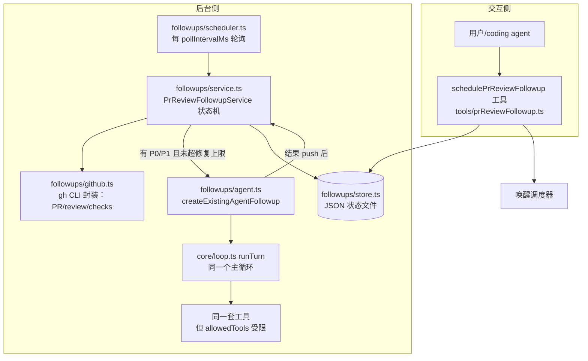

# 08 · Sub-agent / 后台 Agent：followups 系统解剖

> 先给结论：**这个项目没有「父 agent 在 run 中途派生 sub-agent」的机制**（没有 Task tool）。
> 但它有一个更完整的形态：**无头后台 agent**——由外部事件（GitHub Review）触发、独立于交互 session 运行、复用同一个 loop 和工具集、带受限权限（注意：任务独立存在 ≠ 可以并发执行，工作区操作通过串行队列与交互 run 互斥，见后文与 [10](10-error-recovery.md)）。这就是 `runtime/followups/`。

## 全景：一次 PR Review 自动跟进的生命周期

场景：用户提交 PR → AGENTS.md 工作流要求模型调 `schedulePrReviewFollowup` 工具登记任务 → 后台调度器轮询 GitHub 等 Codex Review → 有 P0/P1 就唤醒一个后台 agent 修 → push → 等下一轮 review → 直到 CI 过、无阻塞问题。



## 三个组件逐个看

### 1. 状态机：PrReviewFollowupService（followups/service.ts:22）

任务状态（`followups/types.ts:3-9`）：

```
waiting_review → repairing → waiting_ci → ready（终态）
                    ↘ blocked（终态：超修复上限/CI失败/连续错误3次）
```

核心方法 `process(taskId)`（`service.ts:32-48`）每次做一件事然后退出（调度器稍后再来）：
- PR 关了/合并了 → 终态（`service.ts:51-58`）
- PR head 变了 → 重置等待新一轮 review（`resetForHead` `:201`）
- 等 review：请求 Codex review，两次超时就 blocked（`waitForReview` `:157-180`）
- review 完成：**有 P0/P1 或 P2 都会唤醒修复 agent**（`processReview` `:82-155`：P2 与 P0/P1 一样进入 `repairing` 并调用 `runAgent` `:118-121`，只是期望 agent 对 P2 自行判断修不修）；agent 返回 `skipped` 且没有 P0/P1 时，才走「剩余 P2 按个人版规则接受」的路径（`:139-146`）。P3 不触发修复。
- 修复次数上限：简单 PR 3 轮、复杂 PR 5 轮（`types.ts:78-80` `maxRepairAttempts`）——与仓库 AGENTS.md 的 Review 修复结束条件完全一致
- 验证 agent 真干活的证据：**修完比对该 PR head 的 oid 变没变**（`service.ts:123-137`），不轻信 agent 自己返回的 "fixed"
- 容错：连续失败 3 次自动 blocked，不再无限重试（`recordError` `:214-226`）

### 2. 后台 agent：createExistingAgentFollowup（followups/agent.ts:26）

这就是「sub-agent」本尊。看它怎么构造一次 headless 运行：

| 配置 | 值 | 代码 |
|---|---|---|
| session | 全新的（不复用交互历史） | `agent.ts:32-40` |
| system prompt | 专用守则：只修 P0/P1、不 merge、不部署、push 必须独立命令 | `agent.ts:33-38` |
| allowedTools | 全部工具**减去** deployMain/startProcess/schedulePrReviewFollowup 等 | `getFollowupAllowedTools` `agent.ts:90-96` |
| approve 回调 | **只放行一条精确匹配的命令**：`git -C <workspace> push origin HEAD:refs/heads/<branch>`（还校验路径/分支名是安全字符） | `approveFollowupGitPush` `agent.ts:132-141` |
| 输出协议 | 要求最后一行只输出 JSON：`{"status":"fixed|skipped|blocked","summary":"..."}` | `buildPrompt` `agent.ts:125-128` |
| 结果解析 | 抠出 JSON；解析不了按 blocked 处理，不崩 | `parseAgentFollowupOutcome` `agent.ts:143-155` |

**这是本仓库最值得学的安全设计**：危险操作（push）不是靠提示词禁止，而是**权限函数白名单到「唯一一条命令字符串」**。

### 3. 调度与互斥

- `followups/scheduler.ts`：setInterval 轮询到期任务；`wake()` 让工具登记后立刻跑一轮而不等下个周期
- **与交互 run 互斥**：`runExclusive` 注入同一个 `SerialTaskQueue`（`apps/server.ts:445`）——后台 agent 修文件时，交互 session 的任务排队等待，避免同一个工作区被并发写

## 对比：经典 Sub-agent 模式

| 维度 | 经典 sub-agent（如 Task tool） | 本项目 followups |
|---|---|---|
| 触发 | 父 agent 在 run 中途调用 | 外部事件（GitHub 状态）+ 定时轮询 |
| 生命周期 | 父 run 内，结果作为 tool result 回到父上下文 | 独立后台任务，跨很长时间 |
| 结果去向 | 父 agent 的 transcript | GitHub（push）+ JSON 状态文件 + 事件广播 |
| 权限 | 通常受限工具集 | 受限工具集 + 命令级审批白名单 |
| 共享 | 同一 loop/工具注册表 | 完全相同（`agent.ts:26` 直接用 runTurn + registry） |

教学版的最小 sub-agent 见 `mini-agent/08-subagent/`：父 agent 用一个 `spawnSubagent` 工具把任务交给一个带独立 loop、受限工具的子 agent，子 agent 最终答案作为观察结果回到父 transcript。

## 一句话总结

followups = **同一个 loop 的第二次「装法」**：换 system prompt、换审批策略、换触发方式（轮询代替用户输入），loop 和工具一行不改。这正是分层架构带来的复用。
