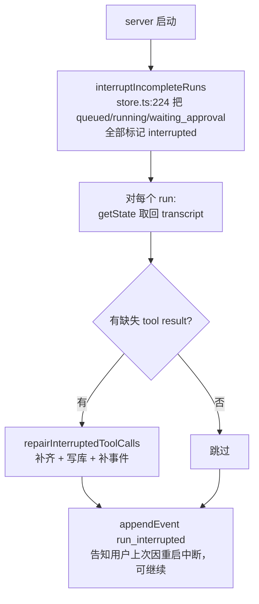

# 10 · 错误恢复、重试与中断

> Agent 是长流程、多副作用（进程、文件、网络）的系统，出错是常态。
> 本篇盘点这个项目的五层防线：**工具层兜错 → loop 层保持配对 → 中断补齐 → 重启恢复 → 外部重试上限**。

## 防线 1：工具层「永不抛」

`tools/exec.ts:20` 的 `runCommand`：非 0 退出、超时、spawn 失败统一 resolve 成 `CmdResult{exitCode, stdout, stderr}`，绝不 reject。超时策略（`exec.ts:75-101`）：

- 到 `timeoutMs`（默认 30 秒）→ SIGTERM 整个进程组
- 再 2 秒不退 → SIGKILL
- 外部 abort → 立即 SIGTERM，3 秒后 SIGKILL（忽略 SIGTERM 的进程也能杀掉）

`executeTool`（`core/loop.ts:392-396`）再把 tool.run 抛的任何异常包成 `error: ...` 观察结果。**模型永远会收到一条可读的失败信息，然后自己决定下一步**——这是 agent 和脚本的分水岭。

## 防线 2：loop 层「调用-结果配对不变式」

发给模型的 transcript 必须满足：每个 assistant 的 toolCall 都有对应 tool result。三处维护这个不变式：

1. **正常路径**：每个 `executeTool` 后立即 push tool result（`core/loop.ts:281`）
2. **stopRun 路径**：审批拒绝时，同轮剩余未执行的 calls 全部补 `cancelled` 结果（`core/loop.ts:283-299`）
3. **abort 路径**：`abortToolLoop`（`core/loop.ts:95-139`）处理三种中止时序（见 [02](02-agent-loop.md) 的表格），其中 executeTool 被 abort 时还有 **5 秒宽限期等真实结果**（`core/loop.ts:262-270`）——因为工具可能已经实际执行了（文件已写、进程已起），宁可记录真实 observation 也不凭空写 cancelled

## 防线 3：崩溃残留修复：repairInterruptedToolCalls

`core/loop.ts:312-344`（纯函数，有测试 `core/loop.test.ts`）。

场景：进程在「模型已声明 toolCalls」和「结果已写入」之间崩掉。修复算法：

```
扫描每条带 toolCalls 的 assistant 消息
  → 收集它后面连续的 role:"tool" 消息里已出现的 toolCallId
  → 缺失的 → 在正确位置插入 error 观察结果：
    "error: 上次运行在工具 X 执行期间中断，未能记录工具结果。请根据当前状态重新确认下一步。"
```

两个调用点：
- 每次 runTurn 开头（`core/loop.ts:153-161`）——用户下一条消息自动修复现场，还 emit 事件告知
- 服务重启时（见下）

## 防线 4：服务重启恢复

`SessionRuntimeStore.recoverInterruptedRuns`（`sessions/runtime-store.ts:236-268`），server 启动时执行（`apps/server.ts:155-156`）：



配合 run 级持久化（`createRun`/`updateRun`，每次状态迁移写库 `runtime-store.ts:420-436`）和 transcript checkpoint（`core/loop.ts` 里每次 push 后 `deps.checkpoint`），恢复粒度是「最后一条消息」。

用户侧还有主动停止：`/stop` 命令 → `runtimeStore.cancel`（`runtime-store.ts:200-214`）→ `AbortController.abort()` → 信号沿着 loop 的 `signalRace`、provider 的 fetch signal、`runCommand` 的进程组 kill 一路生效。

## 防线 5：外部系统的重试与止损

followups（[08](08-subagent.md)）展示了与外部 API 打交道的重试纪律（`followups/service.ts`）：

- **指数不无限**：连续失败计数 `consecutiveErrors`，达上限（默认 3）→ blocked 终态（`recordError` `service.ts:214-226`）
- **状态可恢复**：repairing 状态若进程重启后出现，不盲目继续，按 GitHub 当前 head 重新检查（`service.ts:71-77`）
- **不轻信自述**：agent 说 fixed 不算数，比对 PR head oid 是否真的变化（`service.ts:123-137`）
- **修复轮数上限**：简单 3 轮 / 复杂 5 轮，第 3 轮后判断是否收敛，不收敛就 blocked（`types.ts:78-80` + AGENTS.md 规则）

## 并发安全：SerialTaskQueue

`core/serial-queue.ts`（12 行）：所有「动工作区」的任务（交互 run、compact run、followup agent）都排进同一条队列（`apps/server.ts:63,142,445`），从根上避免并发写。见 [06](06-session-memory.md)。

## 错误处理思想的三个层次（教学总结）

| 层次 | 原则 | 本项目实现 |
|---|---|---|
| 给模型的错误 | 错误是信息，不是崩溃 | observation 化（防线 1/2） |
| 给系统的错误 | 状态可修复、可恢复 | 配对修复 + 重启恢复（防线 3/4） |
| 给世界的错误 | 有界重试 + 验证证据 | 重试上限 + 事实核查（防线 5） |
