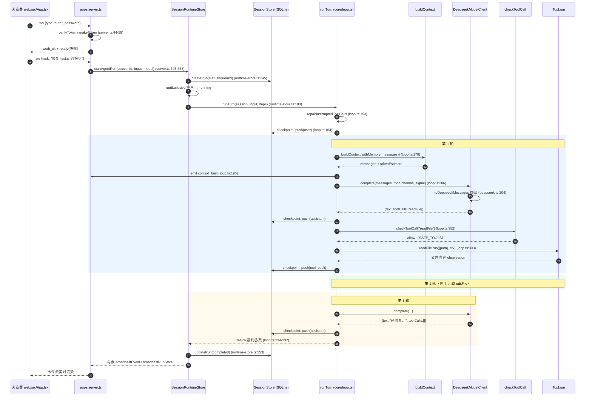

# 11 · 完整调用链：从一条消息到最终答案

> 本篇把前面所有章节串成一条线。场景：**web 页面上用户发一条消息，agent 调了两次工具后给出答案。**

## 全链路（server 模式，最完整的路径）



## 关键数据的一次「变形记」（同一条信息在各层的形状）

| 阶段 | 形状 | 位置 |
|---|---|---|
| transcript 里 | `{role:"tool", toolCallId:"call_1", content:"..."}` | session.messages |
| 裁剪后 | 原样或截断后的同形状 | BuiltContext.messages |
| DeepSeek 请求 | `{role:"tool", tool_call_id:"call_1", content:"..."}` | toDeepseekMessages |
| Anthropic 请求 | user 消息里的 `{type:"tool_result", tool_use_id:"call_1"}` 块 | toAnthropic |
| 事件流 | `{type:"tool_result", id:"call_1", content}` | EventBus → jsonl/SQLite/ws |
| 终端 | `📥 result  ...` | printEvent |

## CLI 模式的差异

`apps/cli.ts` 的链路是上面图的子集：没有 ws/认证/SessionRuntimeStore/run 状态机，直接「装配 → createSession → runTurn」。读代码先读 CLI（119 行），再看 server（471 行）。

## Mock 模式的同一链路

`npm run agent -- --mock` 时，M 换成 MockModelClient（按剧本返回），其余每一步**完全相同**——这让我们能无 key 观察整条链路。mock 剧本本身见 `model/mock.ts:12-42`。

## 十条必记调用链（每条都可以单步验证）

1. 用户输入 → `runTurn`：`apps/server.ts:349` → `runtime-store.ts:180` → `core/loop.ts:147`
2. transcript → context：`core/loop.ts:179` → `context/builder.ts:30`
3. 记忆注入：`core/loop.ts:178` → `memory/store.ts:50` → `withMemoryContext` `core/loop.ts:346`
4. 调模型：`core/loop.ts:206` → `model/deepseek.ts:27`
5. 工具 schema：`core/loop.ts:180` → `tools/registry.ts:26`（zod → JSON Schema）
6. 工具执行：`core/loop.ts:253` → `executeTool:365` → `policy/permissions.ts:35` → `tools/*.ts`
7. 结果回填：`core/loop.ts:281`（push tool result）
8. 停止条件：`core/loop.ts:234`（无 toolCalls）或 `:303`（maxTurns）
9. 持久化：`deps.checkpoint` → `sessions/store.ts:175`（每步）；事件 → `sessions/store.ts:186`
10. 审批：`core/loop.ts:388` → `runtime-store.ts:374`（挂起）→ `:216`（ws 恢复）

## 用 replay 复盘一次真实运行

```bash
cd runtime
npm run agent -- --mock "建一个 hello.js 并运行它"
npm run replay -- runs/<上面打印的文件名>.jsonl   # 同一套 printEvent 重放事件
```

jsonl 里每一行都是一个 TimestampedEvent（`core/events.ts:37-42`：带 ts/seq/sessionId/runId）——**一次 run 的全部决策过程都被结构化记录**，这是做调试和 eval 的地基。
