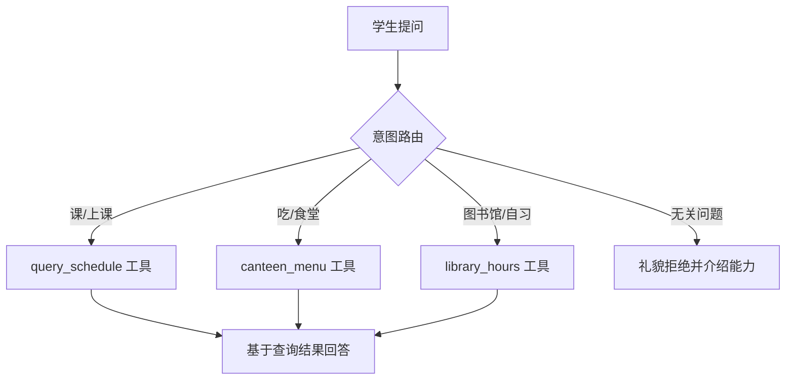

# Demo 5 · Campus Assistant Agent —— 校园助手

## 学习目标

1. 理解**工具选择 = 意图路由**：多个工具并存时，模型根据工具 description 和用户问题「选对那一个」
2. 体会 **description 质量 → 路由准确率**：把 `query_schedule` 的 description 改成空字符串再试，看路由怎么崩
3. 理解**事实性回答必须走工具**：课表、菜单、开放时间都不许「背答案」，必须查询（防幻觉约束）

## Agent 架构



## 核心代码

| 位置 | 作用 |
|---|---|
| 三个工具的 description | 各自带「用户问『课』『食堂』时用」的路由提示——**写给模型的索引** |
| `mockScript` 的关键词分支 | 模拟路由决策；真实模型用语义做同样的事 |
| `pickDay()` | 处理「明天」这种相对时间——演示时间推理是 agent 的难点之一 |

## 运行方式

```bash
cd patterns/campus-assistant-agent
node agent.mjs "明天有什么课？"
node agent.mjs "今天食堂吃什么？"
node agent.mjs "图书馆几点开门？"
node agent.mjs "帮我写期末论文"      # 超出能力范围 → 礼貌拒绝
```

## 示例输入 / 输出（mock 模式）

```
学生: 明天有什么课？

  🔧 query_schedule({"day":"周三"})

小智: 根据查询结果回答：3-4节 线性代数(教三105)  6-7节 智能体导论(计501)
```

```
学生: 图书馆几点开门？

  🔧 library_hours({})

小智: 根据查询结果回答：开放时间 07:30-22:30（周五 07:30-18:00）；四楼自习室需预约
```

## 对应知识点

| 知识点 | 本 Demo | 原项目源码 |
|---|---|---|
| 工具选择 | 模型只在 3 个工具里挑一个 | `tools/registry.ts` 的 `toSchemas()`（全部说明给模型） |
| description 即索引 | 路由提示写进 description | `tools/fileOps.ts:40-42`（editFile 的使用指引） |
| 防幻觉约束 | 「不要凭记忆编造课表」 | system prompt（`config.defaults.ts:23`） |
| 能力边界 | 无关问题拒绝 + 介绍能力 | followup 守则的「不要 merge、不要部署」（`followups/agent.ts:37`） |

## 学生扩展作业

1. 加第 4 个工具 `query_exam`（考试安排），验证模型能自动学会路由
2. 把 `query_schedule` 的 description 清空，测试路由错误率
3. 支持「这周我哪天没课？」——需要多次调用工具（每查一天调一次），体会多工具串联
4. 思考题：工具多了以后（30+）路由会变难，有什么办法？（分类分层、按需加载——引出 skill 渐进式披露，见 `mini-agent/07-skills`）
