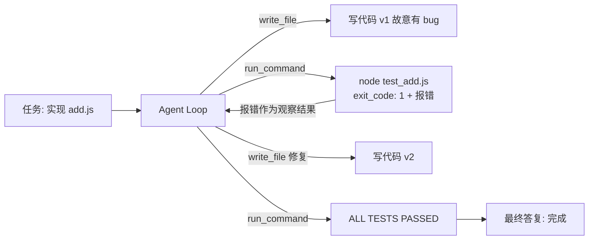

# Demo 3 · Coding Agent —— 简化版编程助手

## 学习目标

1. 理解 Coding Agent 的核心引擎：**测试失败不是异常，而是观察结果**——模型读到报错后自己修复，这正是 agent 与脚本的分水岭
2. 学会**命令白名单**：`run_command` 只放行 `node <file>.js`，其他一律拒绝（对照原项目 followup agent 的「唯一命令审批」）
3. 理解**执行器「永不抛」**：非零退出、超时都变成结构化文本返回

## Agent 架构



## 核心代码

| 位置 | 作用 |
|---|---|
| `run_command` 的白名单正则 | `/^node\s+[\w./-]+\.js$/` ——模型说什么都没用，白名单说了算 |
| `run_command` 的 execFile 回调 | 失败也 resolve，输出 `exit_code + stderr` 给模型 |
| `mockScript` 第 3 阶段 | 演示「模型引用上一条观察结果里的报错来修复」 |

## 运行方式

```bash
cd patterns/coding-agent
node agent.mjs
```

首次运行自动在 `workspace/` 生成 `test_add.js`（3 个断言）。Mock 会**故意先写错**（`a - b`）再修复，完整演示失败→修复→通过的循环。

## 示例输入

```
实现 add.js（导出一个加法函数），让它通过 test_add.js
```

## 示例输出（mock 模式）

```
  🔧 write_file({"path":"add.js","content":"module.exports = (a, b) => a"})
     → wrote 47 chars to add.js
  🔧 run_command({"command":"node test_add.js"})
     → exit_code: 1 | stderr:
AssertionError [ERR_ASSERTION]: 1 == 3
  🔧 write_file({"path":"add.js","content":"module.exports = (a, b) => a"})
     → wrote 35 chars to add.js
  🔧 run_command({"command":"node test_add.js"})
     → exit_code: 0 | stdout:
ALL TESTS PASSED

最终答复: 测试全部通过：add(a,b) 已实现并通过 test_add.js 的 3 个断言。任务完成。
```

## 对应知识点

| 知识点 | 本 Demo | 原项目源码 |
|---|---|---|
| 错误=观察结果 | 测试 stderr 原样回填 | `runtime/core/loop.ts:392-396`（executeTool 的 catch） |
| 执行器永不抛 | execFile 失败也 resolve | `tools/exec.ts:20` 的 `runCommand` |
| 命令白名单 | `node <file>.js` 正则 | `followups/agent.ts:132-141` 的 `approveFollowupGitPush` |
| 写文件路径锁 | `startsWith(WORK_DIR)` | `tools/fileOps.ts:8-15` |

## 学生扩展作业

1. 把测试改成**第一次就通过**的剧本，观察 loop 还会跑几轮？为什么？
2. 加 `read_file` 到修复流程：先读旧代码再改（真实模型的标准动作）
3. 把白名单放宽到 `npm test`，讨论：放宽的风险是什么？
4. 进阶：给 `write_file` 加「写入前必须先 read_file」策略，对照原项目 `editFile` 的 oldText 唯一性设计（`tools/fileOps.ts:38-65`）
