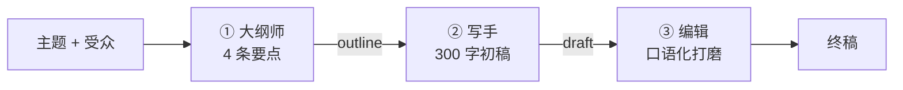

# Demo 7 · Content Creator Agent —— 内容创作流水线

## 学习目标

1. 掌握 **Prompt Chaining（提示词流水线）**：大纲师 → 写手 → 编辑，三个专职 prompt 串成生产线
2. 能判断**流水线 vs Agent Loop** 各适合什么场景：步骤固定用流水线（便宜、可控、好调试），步骤不确定才用 loop
3. 理解「前一步的输出是下一步的输入」——上下文在流水线里是**显式传递**的

## Agent 架构



注意与 Agent Loop 的本质区别：**这个流程图是代码写死的**。Loop 的流程图只有「问模型→执行」一个圈，走几圈、走哪条路是模型现场决定。

## 核心代码

| 位置 | 作用 |
|---|---|
| `pipeline()` | 三次顺序调用，无循环 |
| 三个 system prompt | 每个角色只对自己的阶段负责（职责单一） |
| mock 剧本 | 三个阶段输出相互衔接，演示信息如何沿流水线流动 |

## 运行方式

```bash
cd patterns/content-creator-agent
node agent.mjs "主题：大学生第一门编程语言怎么选"
node agent.mjs "主题：如何准备期末复习" "audience:大二学生"
```

## 示例输入 / 输出（mock 模式，节选）

```
主题: 大学生第一门编程语言怎么选 · 受众: 大一新生

── 第 1 步：大纲 ──
1. 为什么「选语言」是个伪问题
2. 三个候选：Python / JavaScript / C
3. 判断标准：目标方向 > 生态 > 上手难度
4. 我的建议与学习路径

── 第 2 步：初稿 ──
# 大学生第一门编程语言怎么选
## 1. 为什么「选语言」是个伪问题 …

── 第 3 步：终稿 ──
别纠结太久：编程思维是通用的，但第一门语言决定了你能不能坚持下去。
**想搞数据和 AI，选 Python**…
```

## 对应知识点

| 知识点 | 本 Demo | 原项目源码 |
|---|---|---|
| 单步专职调用 | summarize 式的一次调用 | `runtime/commands/compact.ts:49` 的 `summarize()`（压缩历史的独立调用，不在主 loop 里） |
| 上下文显式传递 | outline → draft 的参数 | 与 loop 的「隐藏在 transcript 里」形成对照 |
| 职责单一的 system prompt | 三个角色三个 prompt | followup 的专职守则（`followups/agent.ts:32-40`） |

## 学生扩展作业

1. 加第 4 步「标题优化师」：为终稿生成 3 个候选标题
2. 给第 2 步加失败兜底：初稿少于 100 字时自动重写一次
3. 思考题：如果把这条流水线改成 Agent Loop（给模型 writeDraft/editDraft 工具让它自己决定流程），会得到什么、失去什么？
4. 实验题：把「编辑」的 system prompt 删掉直接用初稿当输入，对比终稿质量——体会专职 prompt 的价值
