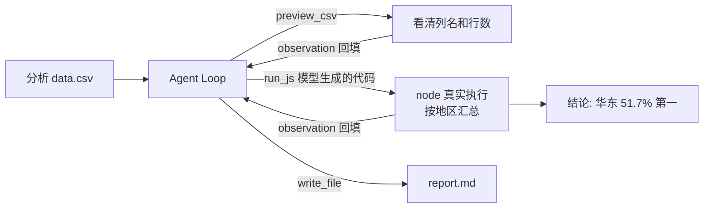

# Demo 4 · Data Analysis Agent —— 数据分析助手

## 学习目标

1. 理解**「代码即工具」**模式：模型不直接算数，而是**生成分析代码**交给 `run_js` 执行——模型负责思路，runtime 负责执行，数字来自真实输出
2. 建立**沙箱意识**：执行模型生成的代码是高危操作，教学版直接跑，生产必须沙箱隔离（对照原项目的 bubblewrap 方案）
3. 掌握「先看数据结构，再写分析代码」的两步分析法（防止模型凭空编造列名）

## Agent 架构



## 核心代码

| 位置 | 作用 |
|---|---|
| `run_js` 工具 | `execFile("node", ["-e", code], { cwd: WORK_DIR })`——代码在固定目录、固定超时内执行 |
| system prompt 约束 | 「禁止编造数字，一切以代码输出为准」——反幻觉约束 |
| `ANALYSIS_CODE` | mock 剧本里「模型生成」的分析代码（真实模式由模型即兴生成） |

## 运行方式

```bash
cd patterns/data-analysis-agent
node agent.mjs
```

首次运行自动生成 `workspace/data.csv`（12 条模拟销售记录：date,region,amount）。

## 示例输入

```
分析 data.csv，告诉我哪个地区卖得最好，并生成 report.md
```

## 示例输出（mock 模式）

```
  🔧 preview_csv({"file":"data.csv","n":4})
     → 总行数: 13 | date,region,amount | 2026-01,华东,1200 | …
  🔧 run_js(…)
     → exit_code: 0 | stdout:
华东: 4930 元 (51.7%) | 华南: 2650 元 (27.8%) | …
  🔧 write_file(…)
     → wrote report to report.md

最终答复: 分析完成：华东 51.7% 是第一大市场，报告已写入 workspace/report.md。

生成的报告（每个数字都解析自 run_js 的真实输出，换一份 CSV 报告就跟着变）:
# 销售数据分析报告
## 结论（每个数字都取自 run_js 的真实输出）
- 华东：4930 元，占 51.7%
- 华南：2650 元，占 27.8%
- 华北：1270 元，占 13.3%
- 西南：680 元，占 7.1%
- 数据共 12 条销售记录
…
```

## 对应知识点

| 知识点 | 本 Demo | 原项目源码 |
|---|---|---|
| 代码执行工具 | `run_js` | `runtime/tools/shell.ts` 的 runShell（同一个思想） |
| 执行超时/永不抛 | `{ timeout: 10_000 }` + 失败 resolve | `tools/exec.ts:20` |
| 沙箱隔离 | 注释指向生产做法 | `tools/sandbox.ts:12`（bwrap 只读根） |
| 长期进程分析 | 不适用 | `tools/process.ts`（分析 dev server 日志） |

## 学生扩展作业

1. 让 agent 分析「增长率」：在 ANALYSIS_CODE 里加环比计算
2. 故意给 run_js 一段会抛异常的代码（读不存在的列），观察报错如何引导模型自修
3. 把 run_js 的超时降到 1 秒，跑一段大循环代码，观察超时处理
4. 思考题：如果模型生成的代码里有 `require('child_process')` 删文件，教学版会发生什么？生产版为什么不会？（提示：`tools/sandbox.ts` 的 `--ro-bind / /`）
