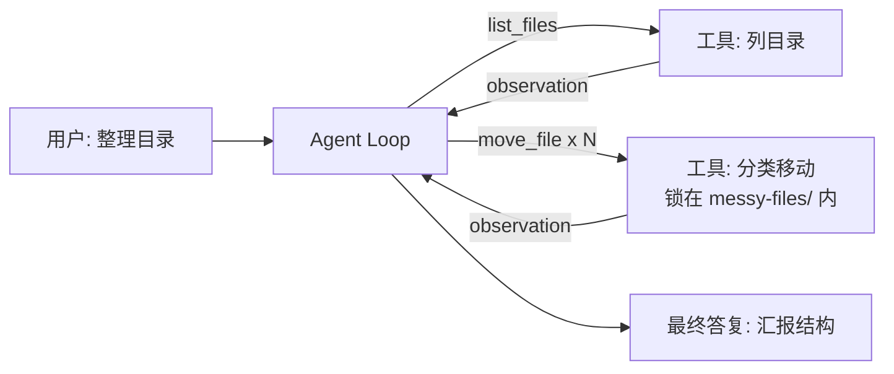

# Demo 1 · File Organizer Agent —— 文件整理助手

## 学习目标

1. 理解 **Tool Calling 完整闭环**：模型看工具说明 → 返回结构化 `tool_calls` → 执行 → 结果回填 → 模型继续
2. 理解 **workingDir 安全边界**：所有文件操作锁死在一个目录里（`path.startsWith` 检查），模型给什么路径都逃不出去
3. 体验**一次模型回复发起多个工具调用**（并行工具调用）

## Agent 架构



一次回复返回 N 个 `move_file` 调用（每个文件一个）——这是「并行工具调用」的真实形态。

## 核心代码

| 位置 | 作用 |
|---|---|
| `TOOLS` 数组 | 三个工具：list_files / peek_file / move_file |
| `move_file` 的路径检查 | `path.join(WORK_DIR, ...)` 后 `startsWith(WORK_DIR)`——对照原项目 `tools/fileOps.ts:8` 的 `resolveInside` |
| `move_file` 的同名冲突检查 | 目标已存在时**拒绝移动并报错**，绝不覆盖——对照原项目 `editFile` 的防误伤设计 |
| 启动复位的安全约束 | 用**内容比对**区分「我们的样例」和「用户数据」：样例内容一致才去重/搬回；用户新文件不覆盖、可正常归类；被用户改过的目录副本绝不触碰 |
| `runTurn()` | 标准Agent Loop（约 20 行） |
| `mockScript()` | 模拟模型决策：从目录观察结果解析文件名 → 按扩展名分类 |

## 运行方式

```bash
cd patterns/file-organizer-agent
node agent.mjs
```

首次运行自动生成 `messy-files/` 演示文件（论文、照片、成绩表、清单、CSV）。重复运行会复位分类结果，且**不会覆盖你在顶层新放的同名文件**——试试运行一次后修改 `messy-files/买菜清单.txt` 再重跑，观察 `move_file` 如何拒绝覆盖并保留两份。配置 `MINI_AGENT_API_KEY` 后由真实模型自由决策分类。

## 示例输入

```
帮我把 messy-files 目录里的文件分类整理好
```

## 示例输出（mock 模式）

```
  🔧 list_files({}) → 论文初稿.docx
听课照片.jpg
课程成绩.xlsx
  🔧 move_file({"name":"论文初稿.docx","folder":"文档"}) → moved 论文初稿.docx → 文档/
  🔧 move_file({"name":"听课照片.jpg","folder":"图片"}) → moved 听课照片.jpg → 图片/
  🔧 move_file({"name":"课程成绩.xlsx","folder":"表格数据"}) → moved 课程成绩.xlsx → 表格数据/
  🔧 move_file({"name":"买菜清单.txt","folder":"文档"}) → moved 买菜清单.txt → 文档/
  🔧 move_file({"name":"实验数据.csv","folder":"表格数据"}) → moved 实验数据.csv → 表格数据/
  🔧 list_files({}) → 文档/
图片/
表格数据/

最终答复: 整理完成！当前目录结构：
文档/
图片/
表格数据/
…
```

## 对应知识点

| 知识点 | 本 Demo | 原项目源码 |
|---|---|---|
| 工具定义四件套 | `TOOLS` | `runtime/tools/types.ts:19` |
| 工具结果回填 | `messages.push({role:"tool"...})` | `runtime/core/loop.ts:281` |
| 路径安全 | `startsWith(WORK_DIR)` | `tools/fileOps.ts:8-15` 的 `resolveInside` |
| 错误当观察结果 | `catch → error: ...` | `core/loop.ts:365` 的 `executeTool` |

## 学生扩展作业

1. 加一个 `delete_file` 工具——思考：为什么它比 move 危险？应该加什么确认机制（对照原项目 `policy/permissions.ts` 的 require_approval）？
2. 让分类支持中文文件夹名、处理重名文件冲突（目标已存在时怎么办？）
3. 把「按扩展名」升级为「按内容」：用 peek_file 读前 200 字符再分类（真实模型会这么做）
4. 记录一份「整理日志」move-log.txt，每次移动追加一行——体会工具副作用的可追溯性
