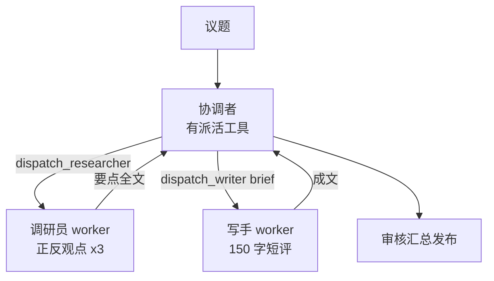

# Demo 8 · Multi-Agent Demo —— 多 Agent 协作

## 学习目标

1. 理解**协调者模式（Orchestrator-Workers）**：协调者有工具、负责拆解派活；worker 是专职角色、无工具只产出内容
2. 理解「**角色 = system prompt**」：调研员和写手没有代码差异，差异全在 prompt 的人设与任务约束
3. 掌握**消息传递纪律**：worker 之间不直接对话，一切经过协调者——避免多 agent 系统失控的第一原则

## Agent 架构



## 核心代码

| 位置 | 作用 |
|---|---|
| `ROLES` 字典 | 角色 = label + system prompt，仅此而已 |
| `dispatch_*` 工具 | 「派活」对协调者来说就是一个普通工具调用；工具的 run 内部跑 worker |
| 观察结果 = worker 产出 | worker 的回复整体作为 tool observation 回到协调者上下文 |

## 运行方式

```bash
cd patterns/multi-agent-demo
node agent.mjs "主题：AI 会不会取代程序员"
node agent.mjs "主题：大学生该不该考研"
```

（mock 模式下议题会真实进入协调者的派活参数，但调研员/写手的产出是固定剧本；配置真实 key 后产出完全由模型生成。）

## 示例输入 / 输出（mock 模式）

```
议题: AI 会不会取代程序员

── 协调者开始调度 ──
  🤖 [调研员] 收到任务: 议题：AI 会不会取代程序员…
  🤖 [调研员] 完成（115 字符）
  🤖 [写手] 收到任务: 支持方：1) AI 提效让程序员做更多事；2) 新岗位（提示工程/Agent 开…
  🤖 [写手] 完成（82 字符）

最终产出:
AI 不会简单地取代程序员，但会重新定义这份工作：重复编码被自动化，需求定义、架构判断和责任承担依然属于人。会用 AI 的程序员将获得杠杆，拒绝使用的人才会被淘汰。
（以上由协调者调度：调研员收集观点 → 写手成文 → 协调者审核发布）
```

## 对应知识点

| 知识点 | 本 Demo | 原项目源码 |
|---|---|---|
| headless worker | 一次角色化 chat 调用 | `followups/agent.ts:26`（新 session + 专用守则跑完整 loop） |
| 产出回传 | observation = worker 全文 | `followups/agent.ts:143`（只回传一行 JSON 结果） |
| 权限按角色分配 | worker 无工具 | `followups/agent.ts:90` 的 `getFollowupAllowedTools` |
| 串行纪律 | worker 顺序执行 | `core/serial-queue.ts`（工作区任务全局串行） |

## 学生扩展作业

1. 加第三个角色「审稿人」：写手产出后，协调者必须先派审稿人打分，≥8 分才发布
2. 给协调者加 `dispatch_parallel` 工具同时派两个调研员（正方/反方），对比效率
3. 思考题：如果写手直接和调研员对话（去掉协调者中转），会发生什么问题？
4. 进阶：把 worker 换成 mini-agent 的完整 loop（带工具），注意要限制它的工具集——为什么？
