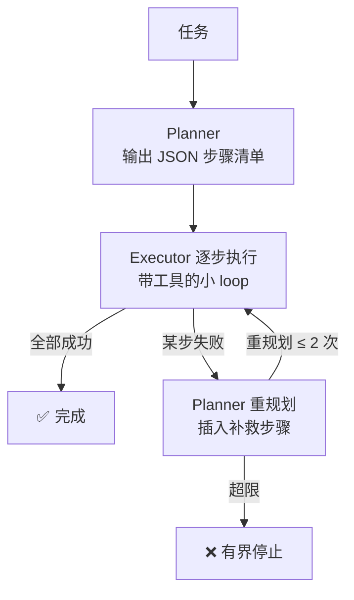

# Demo 10 · Plan & Execute Agent —— 先规划后执行

## 学习目标

1. 理解 **Planner / Executor 分离**：规划器输出显式的 JSON 步骤清单，执行器逐步跑——「想清楚再动手」
2. 理解**计划是可检查的状态**：步骤清单是显式 JSON（能打印、能持久化、能部分更新），与纯 loop 的「隐式计划」形成对照
3. 掌握**失败重规划**：某步失败不硬闯，带着「哪步为什么失败」回到规划器插入补救步骤；重规划次数有上限

## Agent 架构



## 核心代码

| 位置 | 作用 |
|---|---|
| `plan()` | 输出 `{"steps":[{"id":1,"detail":"..."}]}`；失败时把 `failedNote` 喂回重新规划 |
| `executeStep()` | 每步一个独立的小 agent loop（最多 5 轮），步骤间状态由计划清单承载 |
| mock 的步骤 1 故障注入 | 故意漏建 style.css，让验证步骤失败——完整演示失败→重规划→补步骤→通过 |
| 重规划上限 | `replans <= 2`，超限打印停止原因（对照原项目修复轮数上限） |

## 运行方式

```bash
cd patterns/plan-execute-agent
node agent.mjs
```

每次运行会自动重置上次的 `index.html` / `style.css`（按内容比对，只清理本次演示生成的版本；你改过的文件会保留并提示跳过重置），保证「计划漏步 → 验证失败 → 重规划」的完整路径每次都能看到。

## 示例输入 / 输出（mock 模式）

```
任务: 做一个最简单的欢迎页：index.html + style.css，并确认两个文件都在 workspace 里

—— 初始计划 ——
  1. 编写 index.html 欢迎页
  2. 验证 index.html 和 style.css 都存在
  ▶ 执行步骤 1: 编写 index.html 欢迎页
      🔧 write_file → wrote index.html
  ▶ 执行步骤 2: 验证 index.html 和 style.css 都存在
      🔧 list_files → index.html
  ✗ 步骤 2（验证 index.html 和 style.css 都存在） 失败 → 触发重规划

—— 重规划 #1 ——
  2b. 补写 style.css（上次执行发现缺失）
  2. 再次验证 index.html 和 style.css 都存在
  ▶ 执行步骤 2b: 补写 style.css（上次执行发现缺失）
      🔧 write_file → wrote style.css
  ▶ 执行步骤 2: 再次验证 index.html 和 style.css 都存在
      🔧 list_files → index.html

✅ 计划全部完成

最终 workspace 内容: index.html、style.css
```

（初始计划「漏了 style.css」是 mock 故意设计的：真实任务里计划不完整很常见，验证步骤负责暴露缺口，重规划负责补上。）

## 对应知识点

| 知识点 | 本 Demo | 原项目源码 |
|---|---|---|
| 计划=显式状态 | JSON steps 可打印可检查 | `followups/types.ts` 的任务状态字段（显式、可持久化） |
| 失败不硬闯 | 重规划插入补救步骤 | `followups/service.ts:71-77`（repairing 不盲目继续） |
| 有界重试 | 重规划 ≤ 2 次 | `followups/types.ts:78`（3/5 轮修复上限） |
| 逐步验证 | 验证步骤用 list_files | followup 用 PR head oid 核查「真的改了吗」 |

## 学生扩展作业

1. 把计划持久化成 `plan.json`，进程重启后能从未完成的步骤继续（对照原项目 session_runs 表）
2. 给 Planner 加「依赖声明」（step 依赖 step 1），执行器按拓扑序执行
3. 并行执行没有依赖关系的步骤（`Promise.all`），思考与 `core/serial-queue.ts` 串行纪律的冲突
4. 思考题：什么任务不适合先规划？（探索性任务：计划赶不上变化——此时纯 loop 或「规划-执行-反思」混合更合适）
