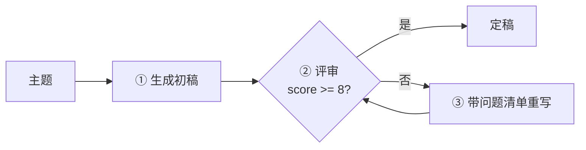

# Demo 9 · Reflection Agent —— 带自我反思的 Agent

## 学习目标

1. 掌握 **Reflection 模式**：生成 → 结构化自我批评（score + issues）→ 带着问题清单重写 → 直到达标或到轮数上限
2. 理解为什么批评必须**结构化**（JSON）：`{"score":5, "issues":[...]}` 让「改什么」变成显式指令，而不是一句「再改好点」
3. 建立**有界重试**意识：及格线（8 分）+ 最大轮数（3）双保险，防止无限自我循环烧钱

## Agent 架构



Reflection 本质上是在生成外面套了一个**小号 Agent Loop**：评审员是「模型自己」，观察结果是「问题清单」。

## 核心代码

| 位置 | 作用 |
|---|---|
| 评审 system prompt | 只输出 JSON、低于 8 分必须给具体问题——**批评的输出契约** |
| `PASS_SCORE` / `MAX_ITERATIONS` | 有界重试的两个参数 |
| 重写 prompt | 原文 + 问题清单一起给——「只修复指出的问题」防止越改越偏 |

## 运行方式

```bash
cd patterns/reflection-agent
node agent.mjs "主题：我为什么想学 AI Agent 开发"
```

## 示例输入 / 输出（mock 模式）

```
—— 初稿（未经反思）——
我想学 AI Agent 开发，因为 AI 很火，我觉得这个方向很有前途，学了应该能找到好工作。

—— 第 1 轮评审：5 分 ——
   · 全是空话，没有任何具体事实
   · 没有例子支撑动机
   · 结尾没有行动项
—— 重写完成 ——
我为什么想学 AI Agent 开发？大三上学期我用大模型 API 写过一个自动整理课程资料的脚本…

—— 第 2 轮评审：9 分 ——
   ✅ 达到 8 分及格线，结束

═══ 最终定稿 ═══
我为什么想学 AI Agent 开发？大三上学期我用大模型 API 写过一个自动整理课程资料的脚本，那一刻我意识到…
```

## 对应知识点

| 知识点 | 本 Demo | 原项目源码 |
|---|---|---|
| 结构化批评 | 评审输出 JSON | resume-agent 的 Schema 校验；`core/loop.ts:378` 的 zod 校验思想 |
| 问题清单=观察结果 | 喂回重写 | `core/loop.ts:281`（工具结果回填的同构：反馈驱动下一步） |
| 有界重试 | score>=8 或 3 轮封顶 | `followups/types.ts:78` 的 `maxRepairAttempts`（3/5 轮上限） |
| 收敛判断 | 分数逐轮上升 | AGENTS.md 修复规则「第 3 轮后确认问题正在收敛」 |

## 学生扩展作业

1. 把评审维度拆成三项各打分（具体性/逻辑/行动项），总分加权
2. 让「初稿」故意由弱 system prompt 生成（"随便写写"），对比反思前后的提升幅度
3. 加一个「反思预算」：每轮打印当前 token 消耗，讨论质量与成本的平衡
4. 思考题：模型给自己打分会不会「自我偏袒」？有什么机制能缓解？（换角色 prompt、分维度评审、外部评审工具——引出多 agent）
