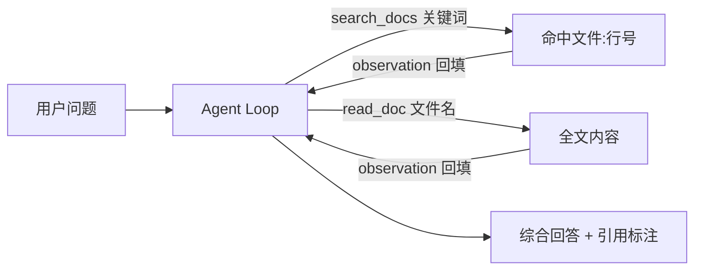

# Demo 2 · Research Agent —— 资料研究助手

## 学习目标

1. 掌握**多步信息收集**模式：先搜索（search_docs）定位 → 再阅读（read_doc）细节 → 最后综合回答
2. 理解**带出处的回答**（引用约束写进 system prompt）：agent 可以被要求「说清每个结论来自哪篇文档」
3. 体会 system prompt 如何改变 agent 行为：不查资料就回答会被视为违约

## Agent 架构



资料库是本地 `corpus/` 目录下的 3 篇 markdown（RAG / 微调 / Tool Calling）。真实场景中把它换成向量库或搜索引擎，架构不变。

## 核心代码

| 位置 | 作用 |
|---|---|
| `search_docs` 工具 | 全文 grep，返回 `文件:行号: 内容`——最朴素的检索 |
| `read_doc` 工具 | 读全文（注意路径检查） |
| system prompt | 「回答必须标注来源文档」——**行为约束的最小实现** |

## 运行方式

```bash
cd patterns/research-agent
node agent.mjs "什么是 RAG？和微调有什么区别？"
node agent.mjs "tool calling 的三次握手是什么？"
```

（mock 模式按关键词选检索词：`微调/fine-tuning` → 「微调」，`tool calling/工具调用` → 「tool calling」，其余 → 「RAG」；再按命中次数选文档。真实模型靠语义完成同样的两步。）

换任何问题都行——资料库里没有的，agent 被要求明说「没有」。

## 示例输入

```
什么是 RAG？和微调有什么区别？
```

## 示例输出（mock 模式）

```
问题: 什么是 RAG？和微调有什么区别？

  🔧 search_docs({"query":"微调"})
     → fine-tuning.md:1: # 微调（Fine-tuning）
  🔧 read_doc({"name":"fine-tuning.md"})
     → # 微调（Fine-tuning）

最终答复:
根据资料《fine-tuning.md》：微调是在预训练模型的基础上，用领域数据继续训练，更新模型参数本身。；微调改变的是「模型是什么」，知识被烧进权重里。…

综合资料：RAG 是检索外部知识注入上下文，改的是「模型能查到什么」；微调（fine-tuning）改的是「模型参数本身」。前者成本低、可随时更新知识库，适合知识频繁变化的场景；后者把知识烧进权重，适合固定风格与格式。
```

```
问题: tool calling 的三次握手是什么？

  🔧 search_docs({"query":"tool calling"})
     → tool-calling.md:1: # Tool Calling（工具调用）
  🔧 read_doc({"name":"tool-calling.md"})

最终答复:
根据资料《tool-calling.md》：Tool calling 让大模型输出结构化的「我想调用某个函数」请求，由外部程序执行后把结果返回给模型。…

以上要点均出自该文档原文，未添加资料之外的内容。
```

## 对应知识点

| 知识点 | 本 Demo | 原项目源码 |
|---|---|---|
| 检索工具设计 | `search_docs` 返回命中行 | `tools/fileOps.ts` 的 read/list 思想 |
| 行为约束进 system prompt | 「必须标注来源」 | `config.defaults.ts:23` 的 systemPrompt |
| 工具观察结果回填 | `role:"tool"` 消息 | `runtime/core/loop.ts:281` |
| 拒答约束 | 「没有的就说没有」 | 防幻觉的最小手段 |

## 学生扩展作业

1. 给 corpus 加 2 篇新文档（如 embeddings.md、vector-db.md），验证 agent 能自动找到
2. 把 `search_docs` 升级为「分词 + 计分」的简易检索（不用向量库）
3. 加一个 `list_docs` 工具并在 system prompt 里引导「不确定有什么资料时先列目录」
4. 思考题：如果检索结果互相矛盾，agent 应该怎么做？把这条规则写进 system prompt
