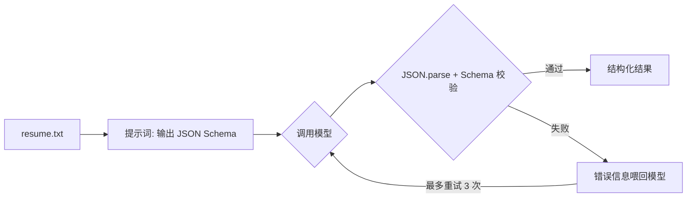

# Demo 6 · Resume Agent —— 简历分析引擎

## 学习目标

1. 掌握**结构化输出**：让模型输出机器可读的 JSON（下游程序能直接消费），而不是给人看的散文
2. 学会**Schema 校验 + 失败自动重试**：不信任模型输出，校验不过就把错误喂回去让它重写
3. 认识真实模型最常见的两种「JSON 病」：Markdown 围栏包裹、对象尾逗号——以及对应的治疗手段

## Agent 架构

这是**单次调用型** agent：没有工具、没有多轮 loop，重点全在输出契约上。



## 核心代码

| 位置 | 作用 |
|---|---|
| `SCHEMA` + `validate()` | 手写校验器（30 行）：类型检查 + 取值范围（matchScore 0-100） |
| `analyzeResume()` 循环 | 「校验失败 → 错误信息作为新 user 消息 → 重试」——把校验器当「工具」用 |
| 围栏剥离 | `raw.replace(/^```(?:json)?\n?|```$/g, "")` |
| mock 三次尝试 | 依次演示：围栏+尾逗号（JSON 解析失败）→ 数组混入数字（Schema 失败）→ 干净结果 |

## 运行方式

```bash
cd patterns/resume-agent
node agent.mjs
```

## 示例输入

`resume.txt`：计算机大三学生王小明的简历（技能、两段经历、自我评价）。

## 示例输出（mock 模式）

Mock 剧本的三次尝试分别演示三类真实故障，让校验-重试循环完整可见：

```
模型: mock

第 1 次尝试：收到 217 字符
  ⚠️ 不是合法 JSON            ← Markdown 围栏 + 尾逗号
第 2 次尝试：收到 162 字符
  ⚠️ Schema 校验失败: experiences 必须是字符串数组   ← 合法 JSON，但数组混入了数字
第 3 次尝试：收到 174 字符

✅ 第 3 次尝试后拿到合法结构化结果:

{
  "name": "王小明",
  "grade": "大三",
  "skills": ["JavaScript", "Python", "SQL"],
  "experiences": ["校科技协会技术部干事", "某公司前端实习 3 个月"],
  "matchScore": 72,
  "suggestions": ["补充一个完整项目经历", "量化实习成果（如性能提升 X%）"]
}
```

## 对应知识点

| 知识点 | 本 Demo | 原项目源码 |
|---|---|---|
| 输出即契约 | SCHEMA 定义 | `model/types.ts` 的中立类型思想（统一形状） |
| 校验不信任输出 | `validate()` | `core/loop.ts:378-379` 的 zod `safeParse`（工具入参校验） |
| 失败重试循环 | 错误喂回重写 | `core/loop.ts:365`（错误当观察结果让模型自修） |
| 解析兜底 | 围栏剥离 + try/catch | `followups/agent.ts:143-155` 的 `parseAgentFollowupOutcome`（解析失败按 blocked 处理） |

## 学生扩展作业

1. 给 `validate` 增加跨字段校验：`skills` 为空时 `matchScore` 不得超过 60
2. 把简历换成英文的，验证提示词约束是否依然有效
3. 加一个「职位要求」输入，让 matchScore 表示「简历 vs 职位」的匹配度
4. 思考题：`response_format: {type:"json_object"}` 已经强制 JSON 了，为什么还要自己校验字段？（格式对≠内容对；schema 约束字段类型与范围）
